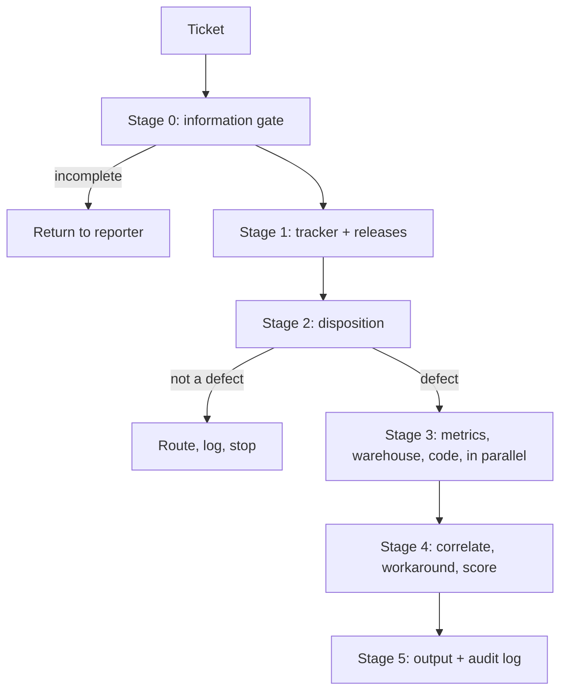

# Architecture

Normative procedure lives in [`skills/bug-triage/SKILL.md`](../skills/bug-triage/SKILL.md).
This page explains the shape and the reasoning behind it.

## The pipeline

### Why the stages sit in that order

**Stage 1 must precede stage 2.** The disposition gate reasons from prior tickets
closed as works-as-designed, duplicate candidates and component history. All of those
come from the tracker. A gate that ran first would have nothing to reason from.

**Stage 3 must follow stage 2.** A non-defect costs two source calls instead of five,
because the expensive sources never run. That is a cost property, but the real reason
is correctness: scoring something that is not a defect is the failure this design
exists to prevent.

## Shared core versus per-team

| Shared, versioned, never forked | Per team, one file |
| --- | --- |
| Disposition taxonomy | Tracker project key and instance id |
| Priority rubric, escalation classes, caps | Priority name mapping |
| Confidence definition | Which sources are live, fixture or off |
| Output format | Warehouse query templates |
| Stage ordering, degradation rules | Repository list |
| Source contract | Component-to-team routing |
| | Release manifest adapters |
| | Tool-name bindings for non-tracker sources |

Nothing under `skills/` or `reference/` may name a product, schema, repository or
customer. That constraint is what lets one rubric serve two product lines running at
different quality bars. It is worth enforcing with a grep in CI rather than by
discipline.

## Source modes

Every source is `live`, `fixture` or `off`.

- **live** calls the real system. On failure it returns an error status and **never**
  falls back to fixtures. Silent fallback is how people end up trusting fake numbers.
- **fixture** reads a recorded envelope. Fixtures are recordings of the live contract,
  not a parallel code path, which is what makes demo-to-production a config change.
- **off** returns `unavailable` immediately. A normal state, not a failure.

Any output built on a fixture carries a `DEMO DATA` banner.

## The source contract

Every source returns the same envelope regardless of mode, so nothing downstream knows
or cares where the data came from. Shapes and per-source fields are defined in
[`skills/data-sources/SKILL.md`](../skills/data-sources/SKILL.md).

The validator checks every fixture against the same shape a live adapter produces. If
the validator ever needs a special case for a fixture, demo and production have quietly
diverged and the contract is no longer enforced.

## Parallelism and the read-only guarantee

Stage 3 delegates one subagent per source and waits for all of them. The delegation is
stated in the orchestrator skill rather than relying on any single client's bundled
agent files, so it holds across Claude, Cursor and Codex.

The files in `agents/` carry tool allowlists matching read-shaped verbs only. That is
what makes "cannot write to the tracker or run DDL" enforced rather than merely stated.
Claude and Cursor load them; Codex does not, so there the guarantee rests on the
read-only service account and the validator's SQL check. See
[`STATUS.md`](../STATUS.md) for the full comparison.

## Component map

| Directory | Holds | Loaded by |
| --- | --- | --- |
| `skills/` | Orchestrator and five component skills | all three clients |
| `reference/` | Taxonomy, rubric, output templates, calibration guide | read by the skills |
| `agents/` | One enrichment subagent per source, with tool allowlists | Claude, Cursor |
| `commands/` | Thin wrappers: triage, release-impact, doctor, review | Claude, Cursor |
| `teams/` | One config per team, plus schema and example | read by the skills |
| `fixtures/` | Recorded envelopes and worked examples | demo mode |
| `scripts/` | `validate_config.py`, the build gate | CI and packaging |
| `logs/` | Audit log destination | runtime |
