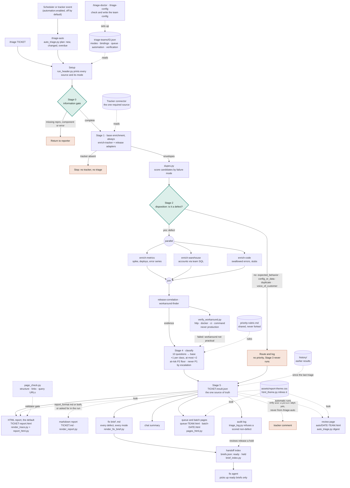
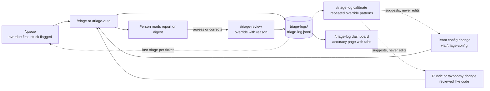
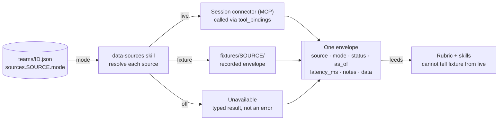

# Architecture

Normative procedure lives in [`skills/bug-triage/SKILL.md`](../skills/bug-triage/SKILL.md).
This page explains the shape and the reasoning behind it.

## The pipeline

Dashed boxes are conditional. Enrichment runs only when its source is not `off`; each
`live` source gets its own subagent, and `fixture` sources are read directly.
Verification and automatic triage run only when the team config turns them on. The
disposition diamond is the design: a non-defect leaves with no priority, and the audit
log refuses to record one that carries a priority.

Every output after Stage 5 is rendered by a script from the one result file, so the
HTML report, the markdown report, the fix brief and the digest cannot disagree. The HTML
report is the default; `output.report_format` decides whether a markdown report is also
written (`md`, `both`), or only the result file and the fix brief (`agent`). Every HTML
page inlines `assets/report-theme.css`, so each one is a single file that opens anywhere.
Before a re-run writes a new result, `history.py` archives the old one, and the report
opens with what changed.

A fix agent never reads the reports folder directly. After every run `brief_index.py`
writes `briefs.json`: the briefs that are `ready`, and the ones `held` because a person
must decide, a fix already exists, or the location evidence is weak. A review recorded
with `/triage-review` releases a human-review hold on the next run. `page_check.py`
runs in the validator on every page, so a broken tag or an old-shape query link fails
the build instead of reaching a reader.

## Commands

| Command | Group | What it does |
| --- | --- | --- |
| `/triage-config` | Set up | Writes or updates a team config by asking a few questions |
| `/triage-doctor` | Set up | Checks the config and that every source is reachable |
| `/triage` | Run | Triages one ticket or a batch, end to end |
| `/triage-auto` | Run | Unattended triage of new, changed and overdue bugs, when the config turns it on |
| `/release-impact` | Run | Which recent release most likely touched a bug's area |
| `/queue` | Review | Open bugs, what still needs triage, overdue and stuck ones |
| `/triage-log` | Review | Recent decisions, accuracy, calibration, dashboard |
| `/triage-review` | Review | Records a person's override, which the agent learns from |

## The feedback loop

The gap between what the agent recommended and what a person decided is the only
measurement the system has. The loop turns that gap into proposed changes, and a person
decides which to make.

### Why the stages sit in that order

**Stage 1 must precede stage 2.** The disposition gate reasons from prior tickets
closed as works-as-designed, duplicate candidates and component history. All of those
come from the tracker. A gate that ran first would have nothing to reason from.

**Stage 3 must follow stage 2.** A non-defect costs two source calls instead of five,
because the expensive sources never run. That is a cost property, but the real reason
is correctness: scoring something that is not a defect is the failure this design
exists to prevent.

## Shared core versus per-team

| Shared, versioned, never forked | Per team, one file |
| --- | --- |
| Disposition taxonomy | Tracker project key and instance id |
| Priority rubric, escalation classes, caps | Priority name mapping |
| Confidence definition | Which sources are live, fixture or off |
| Output format | Warehouse query templates |
| Stage ordering, degradation rules | Repository list |
| Source contract | Component-to-team routing |
| | Release manifest adapters |
| | Tool-name bindings for non-tracker sources |

Nothing under `skills/` or `reference/` may name a product, schema, repository or
customer. That constraint is what lets one rubric serve two product lines running at
different quality bars. It is worth enforcing with a grep in CI rather than by
discipline.

## Source modes

Every source is `live`, `fixture` or `off`.

- **live** calls the real system. On failure it returns an error status and **never**
  falls back to fixtures. Silent fallback is how people end up trusting fake numbers.
- **fixture** reads a recorded envelope. Fixtures are recordings of the live contract,
  not a parallel code path, which is what makes demo-to-production a config change.
- **off** returns `unavailable` immediately. A normal state, not a failure.

Any output built on a fixture carries a `DEMO DATA` banner.

## The source contract

Every source returns the same envelope regardless of mode, so nothing downstream knows
or cares where the data came from. Shapes and per-source fields are defined in
[`skills/data-sources/SKILL.md`](../skills/data-sources/SKILL.md).

The plugin declares no connectors. Switching a source from `off` to live is a
`tool_bindings` entry, a query template where one applies, and a mode change.

The validator checks every fixture against the same shape a live adapter produces. If
the validator ever needs a special case for a fixture, demo and production have quietly
diverged and the contract is no longer enforced.

## Parallelism and the read-only guarantee

Stage 3 delegates one subagent per **live** source and waits for all of them. Fixture
sources are read directly: a subagent to read a local file adds latency and
parallelises nothing. The delegation is stated in the orchestrator skill rather than
relying on any single client's bundled agent files, so it holds across Claude, Cursor
and Codex.

The files in `agents/` declare `tools: ["*"]`. An earlier version used pattern
allowlists and this document claimed they enforced read-only. **They did not.** A live
test showed the patterns granted no MCP tools at all, and even working, a
`get`/`search`/`list` name filter is not semantic: `get_auth_token` mutates.

Read-only is an instruction to the agent. The enforcement lives elsewhere and applies
on every client equally: a read-only service account, the validator's SQL check, and
per-ticket confirmation before anything is written.

## Component map

| Directory | Holds | Loaded by |
| --- | --- | --- |
| `skills/` | Orchestrator, five component skills, triage-config setup, the queue, the log and override skills, readiness, and automatic triage | all three clients |
| `reference/` | Taxonomy, rubric, output templates, run visibility, calibration guide | read by the skills |
| `agents/` | One enrichment subagent per source, `tools: ["*"]` | Claude, Cursor |
| `commands/` | Thin wrappers: triage, queue, triage-log, triage-config, release-impact, doctor, review, triage-auto | Claude, Cursor |
| `teams/` | Shipped demo configs, schema and example. A team's own config lives in its repo under `triage-teams/`, found first | read by the skills |
| `fixtures/` | Recorded envelopes, and worked result files under `results/` | demo mode, tests |
| `assets/` | `report-theme.css`, the stylesheet every HTML page inlines | `html_theme.py` |
| `scripts/` | Header (`run_header.py`); renderers for the HTML report (`render_trace.py`, `report_html.py`), markdown report, fix brief, queue, and queue and batch pages (`pages_html.py`); `html_theme.py` for the look; shared `summary.py`, `links.py`, `timeline.py`, `history.py`; `dupes.py` duplicate scoring; `verify_workaround.py`; `auto_triage.py`; `triage_log.py` with `calibration.py`; `validate_config.py` build gate | runtime, CI, packaging |
| `logs/` | Unused at runtime. The audit log lives in the working folder, `triage-logs/`, because an installed plugin is read-only | none |

The header, the reports, the fix brief, the queue, the batch page and the digest are all
rendered by code, not written by the model. The header and the trace were first
model-written, and a real run showed the header abbreviated and the traces not produced
at all; the report followed in 0.7.0 for the same reason.
